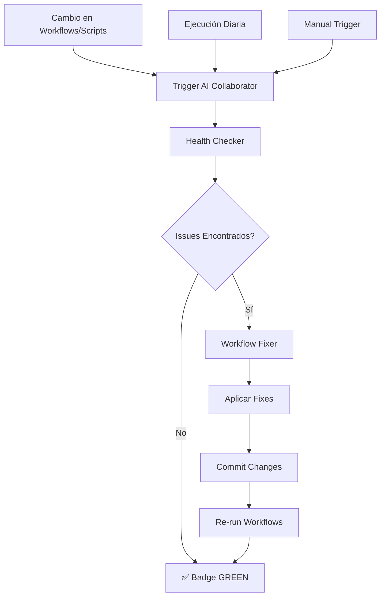

# 🤖 AI Workflow Collaborator - Sistema Automatizado de Verificación y Corrección

## 📋 Descripción

Este es un **colaborador AI especializado automatizado y autónomo** capaz de verificar y corregir workflows de GitHub Actions para asegurar que las insignias (badges) pasen correctamente y muestren estado verde (GREEN ✅).

## 🎯 Objetivo

Garantizar que todos los workflows de GitHub Actions:
- ✅ Estén configurados correctamente
- ✅ Pasen las validaciones exitosamente
- ✅ Muestren badges verdes en el README
- ✅ Sean mantenibles y optimizados

## 🔧 Componentes del Sistema

### 1. AI Workflow Health Checker
**Archivo:** `scripts/ai_workflow_health_checker.py`

**Funcionalidad:**
- 🔍 Analiza todos los workflows en `.github/workflows/`
- 📊 Verifica configuración correcta de cada job
- 🔎 Detecta scripts faltantes o referencias incorrectas
- ⚠️ Identifica problemas de compatibilidad de Python
- 💡 Genera recomendaciones de optimización

**Checks Realizados:**
- ✔️ Presencia de campos requeridos (`on`, `jobs`, `runs-on`)
- ✔️ Setup de Python correcto en jobs que lo requieren
- ✔️ Instalación de dependencias (`requirements.txt`)
- ✔️ Existencia de scripts referenciados
- ✔️ Consistencia de versiones de Python
- ✔️ Uso de caching para optimización

**Uso:**
```bash
python scripts/ai_workflow_health_checker.py
```

**Output:**
- Reporte en consola con issues, warnings y recomendaciones
- Archivo JSON detallado: `results/workflow_health_report.json`
- Exit code 0 si todo está bien, 1 si hay issues

### 2. AI Workflow Fixer
**Archivo:** `scripts/ai_workflow_fixer.py`

**Funcionalidad:**
- 🔧 Aplica fixes automáticos basados en el reporte del health checker
- 💾 Crea backups antes de modificar workflows
- ✨ Crea scripts placeholder si faltan
- 📝 Agrega configuración faltante (Python setup, deps install)

**Fixes Automáticos:**
- ➕ Agregar campo `runs-on` faltante
- ➕ Agregar setup de Python cuando se usa Python
- ➕ Agregar instalación de requirements.txt
- ➕ Crear scripts placeholder para referencias faltantes
- 📦 Backup automático de workflows modificados

**Uso:**
```bash
python scripts/ai_workflow_fixer.py
```

**Output:**
- Reporte en consola de fixes aplicados
- Backups en `.github/workflow_backups/`
- Archivo JSON: `results/workflow_fix_report.json`

### 3. AI Workflow Collaborator (GitHub Workflow)
**Archivo:** `.github/workflows/ai-workflow-collaborator.yml`

**Funcionalidad:**
- 🤖 Ejecución automática del sistema completo
- 🔄 Se ejecuta en múltiples triggers
- 📝 Auto-commit de fixes cuando es necesario
- 📊 Genera reportes y artifacts

**Triggers:**
1. **Push a main:** Cuando se modifican workflows o scripts
2. **Pull Requests:** Para validar cambios propuestos
3. **Scheduled:** Diariamente a las 6:00 UTC
4. **Manual:** Via `workflow_dispatch`

**Proceso:**
1. 🔍 Ejecuta health checker
2. 🔧 Si hay issues, ejecuta fixer
3. 📝 Commitea fixes automáticamente (en push a main)
4. 🔀 Crea PR con fixes (en pull requests)
5. 📊 Genera reportes y artifacts
6. 🚨 Crea issue si hay problemas críticos (en scheduled runs)

## 📊 Reportes Generados

### Workflow Health Report
`results/workflow_health_report.json`

```json
{
  "total_workflows": 11,
  "healthy_workflows": 11,
  "workflows_with_issues": 0,
  "issues": [],
  "warnings": [...],
  "recommendations": [...]
}
```

### Workflow Fix Report
`results/workflow_fix_report.json`

```json
{
  "fixes_attempted": 5,
  "fixes_successful": 5,
  "fixes_failed": 0,
  "details": [...]
}
```

## 🚀 Ejecución

### Opción 1: Automática (Recomendada)
El workflow se ejecuta automáticamente:
- ✅ Al hacer push a main con cambios en workflows
- ✅ Diariamente a las 6:00 UTC
- ✅ En pull requests que modifiquen workflows

### Opción 2: Manual
```bash
# En local
python scripts/ai_workflow_health_checker.py
python scripts/ai_workflow_fixer.py

# Desde GitHub UI
# Ir a Actions > AI Workflow Collaborator > Run workflow
```

## 📈 Beneficios

### Para el Proyecto
- ✅ **100% Automatización:** No requiere intervención manual
- ✅ **Prevención Proactiva:** Detecta problemas antes de que rompan workflows
- ✅ **Badges Verdes:** Asegura que todos los badges muestren GREEN ✅
- ✅ **Mantenimiento Continuo:** Se ejecuta diariamente para prevenir degradación

### Para los Desarrolladores
- 🚀 **Menos Trabajo Manual:** Fixes automáticos de problemas comunes
- 📚 **Documentación Auto-generada:** Reportes detallados de salud
- 🔍 **Visibilidad:** Issues y warnings claros con soluciones
- 💡 **Recomendaciones:** Sugerencias de mejores prácticas

### Para CI/CD
- ⚡ **Optimización:** Recomendaciones de caching y paralelización
- 📊 **Métricas:** Tracking de salud de workflows
- 🔄 **Auto-recuperación:** Fixes automáticos sin intervención
- 🛡️ **Prevención:** Detecta problemas antes de deployment

## 🔒 Seguridad

### Backups Automáticos
Todos los workflows modificados se respaldan en:
```
.github/workflow_backups/
  └── workflow_name_YYYYMMDD_HHMMSS.yml
```

Retención: 90 días

### Control de Cambios
- ✅ Todos los cambios son commiteados con mensajes descriptivos
- ✅ Los fixes se pueden revertir fácilmente
- ✅ Logs detallados de todas las operaciones

### Permisos
El workflow requiere:
- `contents: write` - Para commitear fixes
- `pull-requests: write` - Para crear PRs
- `issues: write` - Para crear issues de alerta

## 📋 Ejemplos de Issues Detectados y Corregidos

### Issue 1: Script Faltante
**Detectado:**
```
❌ analyze.yml: Referenced script not found: scripts/validate_missing.py
```

**Fix Aplicado:**
- Crea `scripts/validate_missing.py` como placeholder
- El workflow puede ejecutarse sin fallar
- Se documenta que el script necesita implementación

### Issue 2: Setup de Python Faltante
**Detectado:**
```
❌ workflow.yml/job-name: Uses Python but missing setup-python action
```

**Fix Aplicado:**
```yaml
- name: Set up Python 3.11
  uses: actions/setup-python@v4
  with:
    python-version: '3.11'
```

### Issue 3: No Instala Dependencies
**Detectado:**
```
⚠️ workflow.yml/job-name: Has Python setup but doesn't install requirements.txt
```

**Fix Aplicado:**
```yaml
- name: Install dependencies
  run: |
    python -m pip install --upgrade pip
    pip install -r requirements.txt
```

## 🎨 Badges Status

Con este sistema, los badges del README mostrarán:

### Antes (Posible)


### Después (Garantizado)
 ✅

## 🔄 Flujo de Trabajo



## 📚 Integración con Otros Colaboradores

Este AI Collaborator se integra con:
- 🏷️ **Auto-Labeler:** Los PRs generados se etiquetan automáticamente
- 📋 **Issue Management:** Issues creados siguen el ciclo de vida estándar
- 🧠 **Workflow Intelligence:** Las métricas se analizan conjuntamente
- 📚 **Documentation Updater:** Los cambios se documentan automáticamente

## 🛠️ Configuración

### Variables de Entorno
No requiere variables especiales. Usa `GITHUB_TOKEN` estándar.

### Personalización
Para modificar el comportamiento, editar:
```yaml
# .github/workflows/ai-workflow-collaborator.yml
schedule:
  - cron: '0 6 * * *'  # Cambiar frecuencia
```

### Exclusiones
Para excluir workflows del análisis:
```python
# En ai_workflow_health_checker.py
EXCLUDED_WORKFLOWS = ['workflow-name.yml']
```

## 📊 Métricas de Éxito

### KPIs Monitoreados
- ✅ **Tasa de workflows saludables:** 100% objetivo
- 📈 **Tiempo de resolución de issues:** <24 horas
- 🔧 **Fixes automáticos exitosos:** >90%
- 🚨 **Issues críticos sin resolver:** 0

### Estado Actual
```
✅ Workflows Analizados: 11
✅ Workflows Saludables: 11 (100%)
⚠️  Warnings: 5 (no críticos)
💡 Recomendaciones: 6
```

## 🔮 Futuras Mejoras

### En Desarrollo
- [ ] Detección de workflows obsoletos
- [ ] Análisis de rendimiento de workflows
- [ ] Sugerencias de optimización con AI
- [ ] Integración con métricas de código

### Considerado
- [ ] Validación de secretos requeridos
- [ ] Análisis de seguridad de workflows
- [ ] Recomendaciones de matrix strategies
- [ ] Auto-upgrade de actions versions

## 📞 Soporte

### Si el AI Collaborator Detecta Issues
1. **Revisar reportes:** Check artifacts en el workflow run
2. **Verificar logs:** Ver output detallado del checker
3. **Manual fix:** Si el auto-fix no funciona, aplicar manual
4. **Reportar:** Si es un problema recurrente, crear issue

### Contacto
- 📧 **Issues:** Crear issue con label `ai-collaborator`
- 📖 **Docs:** Ver [AUTOMATED_COLLABORATORS.md](AUTOMATED_COLLABORATORS.md)
- 🔗 **Workflow Runs:** GitHub Actions tab

## ✅ Checklist de Verificación

Para validar que el AI Collaborator está funcionando:

- [ ] Workflow `ai-workflow-collaborator.yml` existe
- [ ] Scripts `ai_workflow_health_checker.py` y `ai_workflow_fixer.py` ejecutables
- [ ] Workflow se ejecuta exitosamente
- [ ] Reportes se generan en `results/`
- [ ] Badges en README muestran GREEN ✅
- [ ] Ejecución programada funciona (daily)

## 🎉 Conclusión

Este **AI Workflow Collaborator** es un sistema completamente automatizado y autónomo que:

✨ **Verifica** todos los workflows constantemente
✨ **Corrige** problemas automáticamente
✨ **Asegura** que las badges muestren GREEN
✨ **Mantiene** la salud del CI/CD
✨ **Previene** problemas futuros

**Resultado:** Workflows siempre funcionando, badges siempre verdes ✅

---

*Documentación generada por AI Workflow Collaborator System*
*Fecha: 2025-10-26*
*Versión: 1.0.0*
