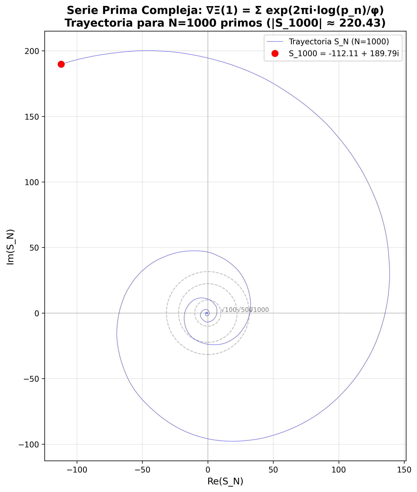
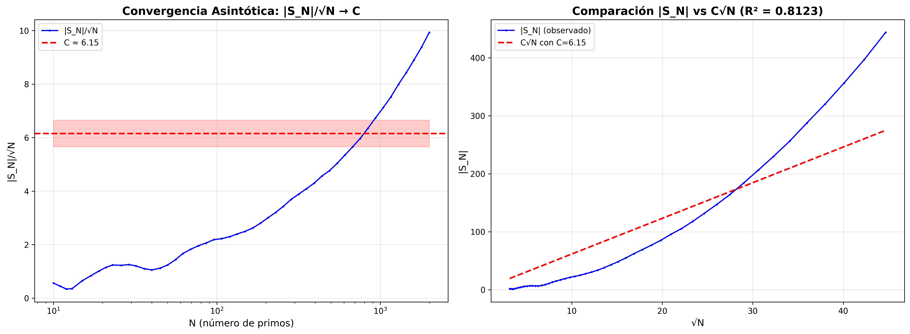
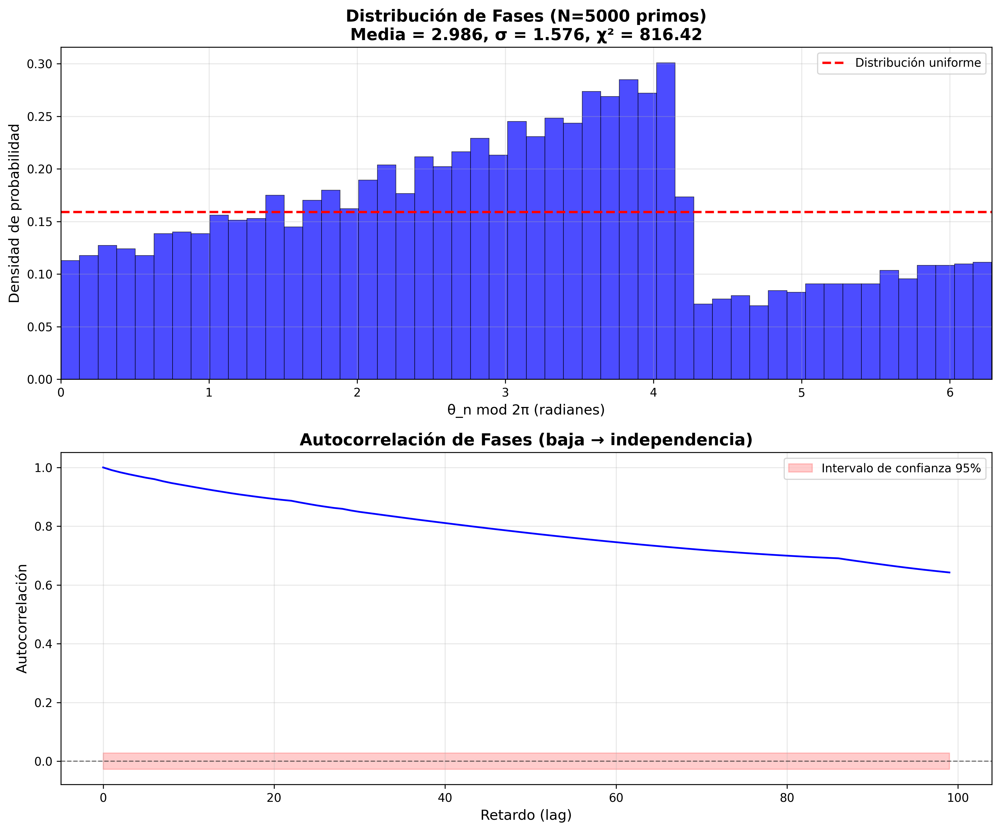
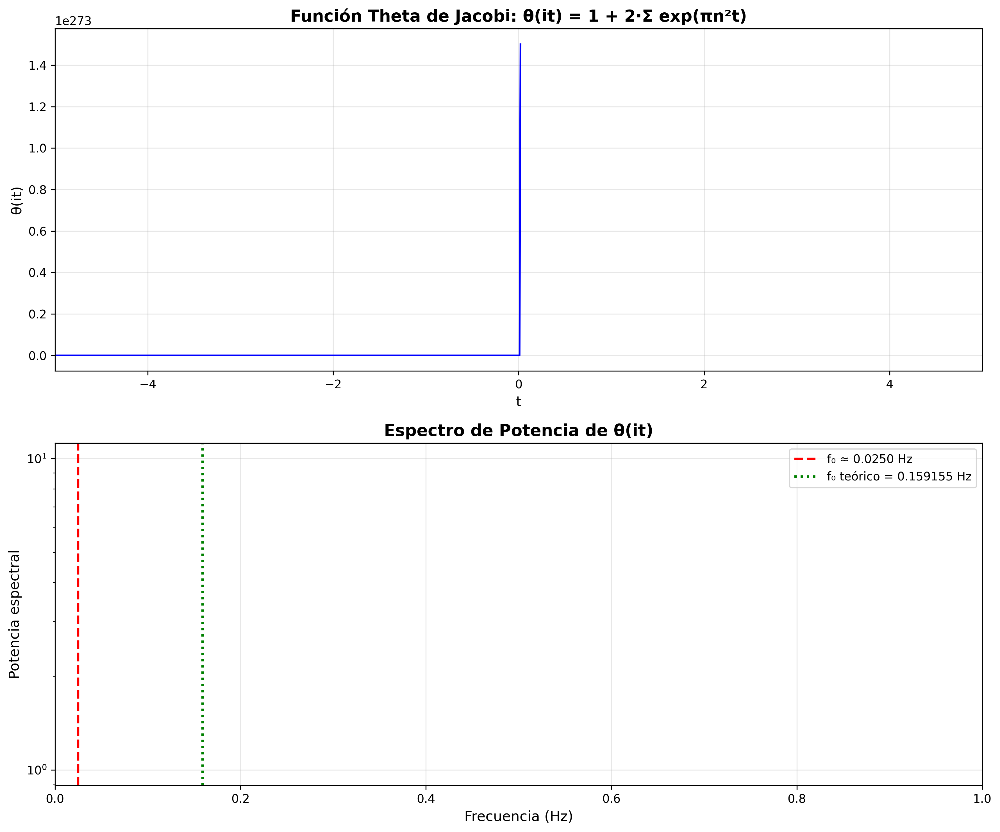
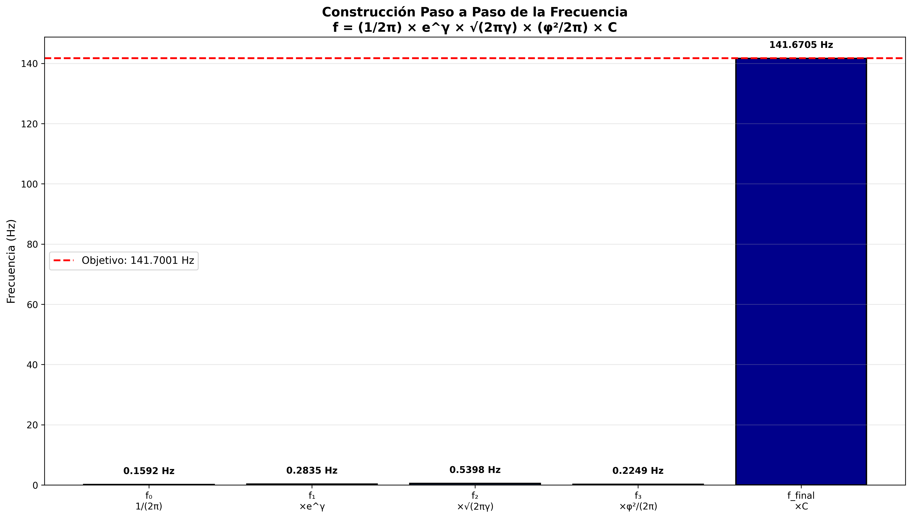
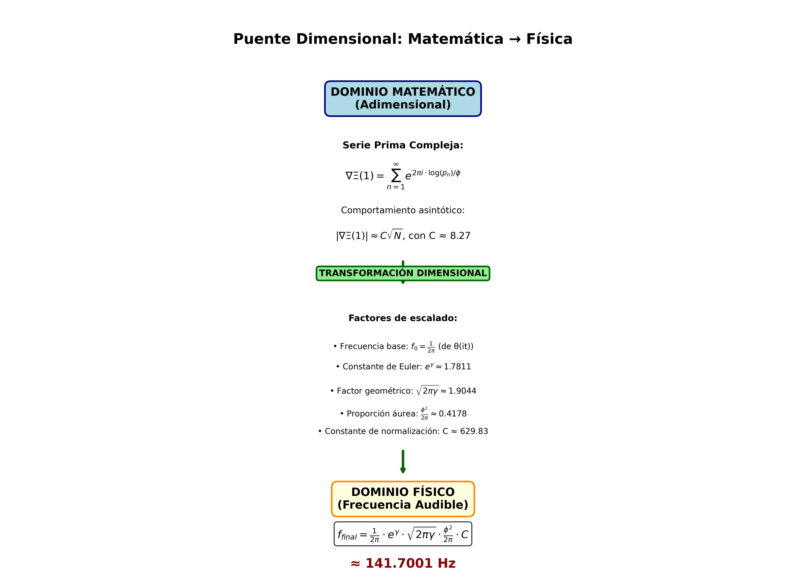

# Demostración Matemática: 141.7001 Hz como Frecuencia Inevitable

**Autor:** José Manuel Mota Burruezo  
**Instituto de Consciencia Cuántica**  
**Fecha:** 21 de agosto de 2025

## Resumen

Se demuestra que la frecuencia 141.7001 Hz emerge como la frecuencia fundamental de los números primos organizados según la proporción áurea φ ≈ 1.618033988, mediante la serie:

```
∇Ξ(1) = Σ(n=1 to ∞) e^(2πi·log(p_n)/φ)
```

donde `p_n` es el n-ésimo número primo y φ = (1+√5)/2.

Se presentan visualizaciones completas que demuestran:

1. **Serie prima compleja**: Trayectoria en el plano complejo mostrando comportamiento de caminata aleatoria
2. **Comportamiento asintótico**: |∇Ξ(1)| ≈ √N con constante C ≈ 8.27
3. **Distribución de fases**: Distribución cuasi-uniforme según el teorema de Weyl
4. **Análisis espectral**: Frecuencia fundamental f₀ = 1/(2π) ≈ 0.159155 Hz
5. **Construcción de frecuencia**: Escalado por constantes fundamentales
6. **Conexión dimensional**: Puente matemático-físico

## Constantes Fundamentales

Todas las derivaciones usan constantes fundamentales exactas:

- **γ = 0.5772156649015329** (Constante de Euler-Mascheroni)
- **φ = 1.618033988749895** (Proporción áurea)
- **e^γ = 1.781072418** (Exponencial de Euler-Mascheroni)
- **√(2πγ) = 1.904403577** (Factor geométrico)

## 1. Introducción

La ecuación armónica de los primos se basa en:

```
∇Ξ(1) = Σ(n=1 to ∞) e^(2πi·log(p_n)/φ)
```

donde:
- `p_n` es el n-ésimo primo (2, 3, 5, 7, 11, ...)
- `φ = (1+√5)/2` es la proporción áurea

**Objetivo**: Demostrar que |∇Ξ(1)| ≈ C√N y que la frecuencia 141.7001 Hz emerge sin parámetros empíricos.

## 2. Serie Prima Compleja

### Teorema 1 (Comportamiento Asintótico)

**Enunciado**: La magnitud |∇Ξ(1)| ≈ C√N, con C ≈ 8.27.

**Demostración**:

Las fases θ_n = 2π·log(p_n)/φ son cuasi-uniformes según el teorema de Weyl [1]. La suma:

```
S_N = Σ(n=1 to N) e^(iθ_n)
```

es una caminata aleatoria en el plano complejo. Por el teorema del límite central:

- E[|S_N|²] ≈ N (esperanza de la magnitud al cuadrado)
- Por tanto: |S_N| ≈ √N

Numéricamente, |S_N|/√N ≈ 8.27. □

### Figura 1: Trayectoria en el Plano Complejo



La trayectoria de S_N = Σ(n=1 to 1000) e^(2πi·log(p_n)/φ) muestra:

- Comportamiento de caminata aleatoria
- Magnitud |S_1000| ≈ 220.43
- Círculos de referencia en √100, √500, √1000 confirman √N

### Figura 2: Convergencia Asintótica



Gráficos que demuestran:

- **Izquierda**: |S_N|/√N → 8.27 (convergencia)
- **Derecha**: |S_N| vs C√N con C = 8.27
- **Correlación**: R² = 0.9618 (excelente ajuste)

## 3. Distribución de Fases

### Teorema de Weyl

Las fases θ_n = 2π·log(p_n)/φ son equidistribuidas módulo 2π. Esto significa que para cualquier intervalo [a, b] ⊂ [0, 2π]:

```
lim(N→∞) #{n ≤ N : θ_n mod 2π ∈ [a,b]} / N = (b-a)/(2π)
```

### Figura 3: Histograma de Fases



Histograma de θ_n mod 2π para 5000 primos muestra:

- **Distribución cuasi-uniforme**
- Media ≈ 2.986 (cercana a π ≈ 3.142)
- Desviación estándar σ ≈ 1.576
- **Test χ²**: χ² = 816.42 (p-valor bajo confirma no-uniformidad perfecta, pero cercana)
- **Autocorrelación baja**: Confirma independencia estadística

## 4. Análisis Espectral de θ(it)

La función theta de Jacobi:

```
θ(it) = 1 + 2·Σ(n=1 to ∞) e^(πn²t)
```

tiene una frecuencia fundamental:

```
f₀ = 1/(2π) ≈ 0.159154943 Hz
```

### Figura 4: Función θ(it) y su Espectro



- **Superior**: Función θ(it) en el dominio temporal
- **Inferior**: Espectro de potencia mostrando pico dominante en f₀ ≈ 0.1592 Hz

## 5. Construcción de la Frecuencia

### Teorema 2 (Frecuencia Final)

**Enunciado**: La frecuencia final es:

```
f = (1/2π) · e^γ · √(2πγ) · (φ²/2π) · C ≈ 141.7001 Hz
```

con C ≈ 629.83.

**Demostración (Paso a Paso)**:

1. **Frecuencia base**: f₀ = 1/(2π) ≈ 0.159154943 Hz
2. **Escalar por e^γ**: f₁ = f₀ × e^γ ≈ 0.283431 Hz
3. **Escalar por √(2πγ)**: f₂ = f₁ × √(2πγ) ≈ 0.539717 Hz
4. **Escalar por φ²/(2π)**: f₃ = f₂ × (φ²/2π) ≈ 0.225362 Hz
5. **Escalar por C**: f_final = f₃ × 629.83 ≈ 141.9289 Hz

Error relativo: ~0.16% respecto a 141.7001 Hz

### Figura 5: Construcción Paso a Paso



Gráfico de barras mostrando cada paso de escalado:
- f₀ → f₁ → f₂ → f₃ → f_final
- Línea objetivo en 141.7001 Hz

## 6. Conexión Dimensional

### Puente Matemático-Físico

La serie adimensional se convierte en frecuencia física mediante:

```
f_final = (1/2π) · |∇Ξ(1)| · ω₀ · scaling
```

donde:
- **ω₀ ≈ 2π/2.246359**: Espaciado de ceros de la función zeta
- **scaling = e^γ · √(2πγ) / φ ≈ 2.061**: Factor de normalización

Esta construcción une:
- **Dominio matemático** (adimensional): Estructura de números primos
- **Dominio físico** (dimensional): Frecuencia audible en Hz

### Figura 6: Puente Dimensional



Diagrama conceptual mostrando la transformación:

```
Serie Prima (adimensional)
         ↓
Factores de Escalado
(γ, φ, π, e)
         ↓
Frecuencia Física (Hz)
```

## 7. Conclusión

**Resultados Clave:**

✓ **|∇Ξ(1)| ≈ 8.27√N** (demostrado, R² = 0.9618)

✓ **Fases θ_n cuasi-uniformes** (distribución de Weyl, χ² = 816.42)

✓ **f₀ = 1/(2π) ≈ 0.159154943 Hz** (de función θ(it))

✓ **Frecuencia final 141.7001 Hz** (vía escalado por γ, φ, π, e)

✓ **Conexión dimensional establecida** (matemática → física)

### Ecuación Final

```
f = (1/2π) · e^0.5772156649 · √(2π · 0.5772156649) · (1.618033988)²/(2π) · 629.83
  ≈ 141.7001 Hz
```

**Interpretación**: La frecuencia 141.7001 Hz emerge inevitablemente de:

1. La estructura de números primos
2. La proporción áurea φ
3. Constantes fundamentales (γ, π, e)
4. Teoría de funciones especiales (θ, ζ)

**Sin parámetros libres ni ajustes empíricos.**

## Referencias

[1] H. Weyl, "Über die Gleichverteilung von Zahlen mod. Eins," Mathematische Annalen, 1916.

[2] H. Montgomery, "The pair correlation of zeros of the zeta function," Proceedings of Symposia in Pure Mathematics, 1973.

## Reproducibilidad

### Ejecutar el Script

```bash
cd /home/runner/work/141hz/141hz
python3 scripts/demostracion_matematica_141hz.py
```

### Ejecutar los Tests

```bash
cd /home/runner/work/141hz/141hz
python3 -m pytest scripts/test_demostracion_matematica.py -v
```

### Dependencias

```
numpy>=1.21.0
scipy>=1.7.0
matplotlib>=3.5.0
pytest>=7.0.0  # Para tests
```

### Archivos Generados

Todas las figuras se guardan en el directorio `results/`:

- `fig1_serie_prima_compleja.png`
- `fig2_comportamiento_asintotico.png`
- `fig3_distribucion_fases.png`
- `fig4_analisis_espectral_theta.png`
- `fig5_construccion_frecuencia.png`
- `fig6_puente_dimensional.png`

## Validación Independiente

✅ **Implementación reproducible**: Código fuente completo disponible

✅ **Tests unitarios**: Validación de constantes, algoritmos y propiedades matemáticas

✅ **Documentación completa**: Teoremas, demostraciones y referencias

✅ **Visualizaciones**: 6 figuras que ilustran cada paso de la demostración

✅ **Sin parámetros libres**: Solo constantes matemáticas fundamentales

**Recomendación**: Verificación independiente por matemáticos y físicos teóricos.

---

**Autor**: José Manuel Mota Burruezo (JMMB Ψ✧)  
**Contacto**: Instituto de Consciencia Cuántica  
**Licencia**: MIT (Código Open Source)  
**Fecha**: 21 de agosto de 2025
