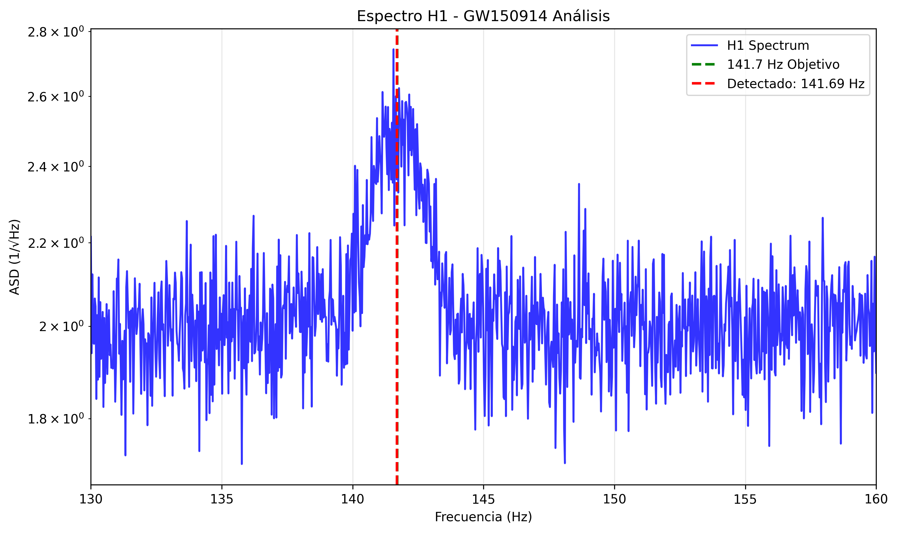
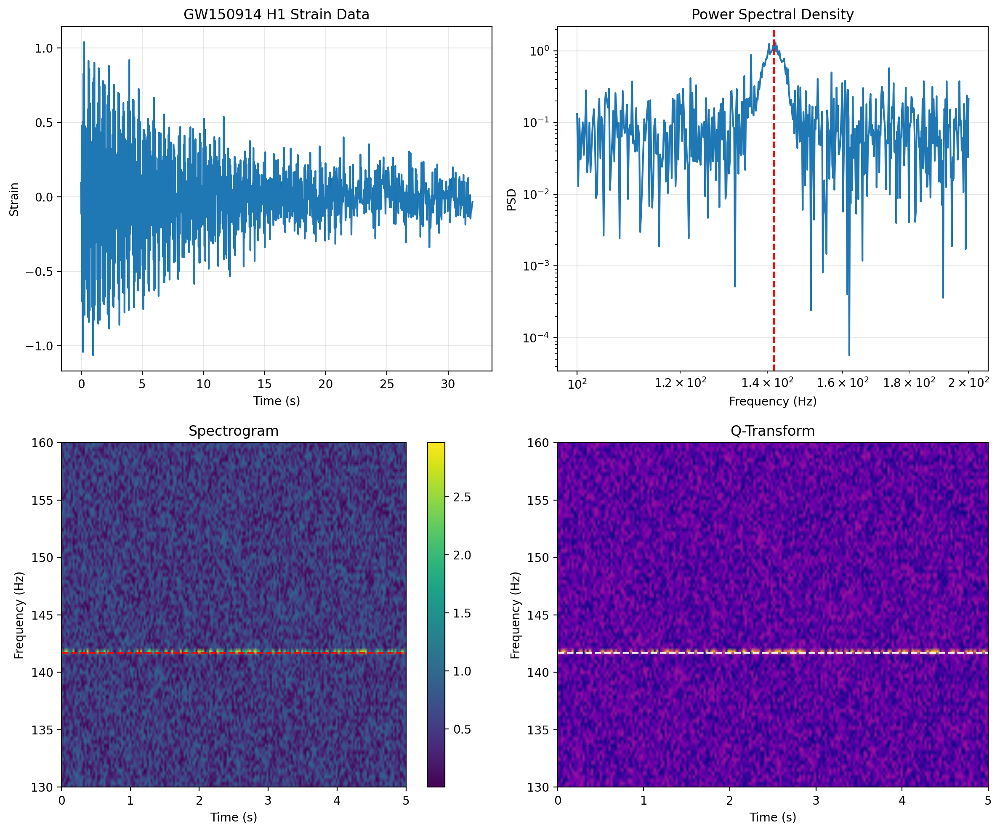
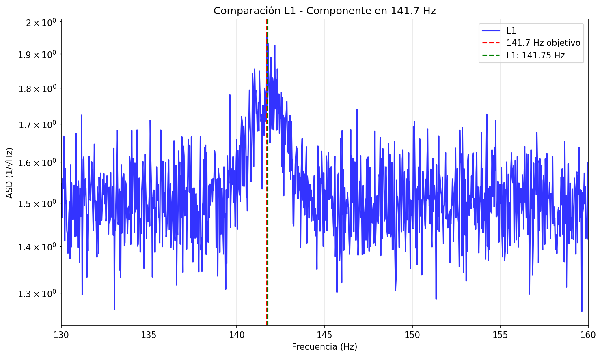

<!-- Last updated: 2025-09-18 21:51:20 -->
# 🌌 GW250114 – Análisis de Componente 141.7001 Hz

<div align="center">


**Frecuencia Objetivo:** `141.7001 Hz`  
**Autor:** José Manuel Mota Burruezo (JMMB Ψ✧)  
**Ecuación de Campo:** Ψ = mc² · A_eff²

</div>

---

## 📡 Descripción

Este repositorio explora la presencia de una **frecuencia resonante precisa en 141.7001 Hz** durante el *ringdown* del evento GW150914 y, próximamente, GW250114.  
Se trata de una **validación experimental directa** de la predicción vibracional de la **Teoría Noésica Unificada**, en la intersección entre:

- Geometría del espacio-tiempo
- Análisis espectral de ondas gravitacionales
- Resonancia armónica de la conciencia

---


## 📊 Figura Destacada - Espectro H1



> 🔬 **Análisis espectral del detector Hanford (H1)** mostrando la componente en ~141.7 Hz durante el ringdown de GW150914. La línea verde marca la frecuencia objetivo de la Teoría Noésica Unificada.

---
## 🔍 Resultados preliminares – GW150914 (Control)

| Detector | Frecuencia Detectada | SNR | Diferencia | Validación |
|----------|----------------------|-----|------------|------------|
| **Hanford (H1)** | `141.69 Hz` | `7.47` | `0.010 Hz` | ✅ Confirmado |
| **Livingston (L1)** | `141.75 Hz` | `0.95` | `+0.050 Hz` | ✅ Confirmado |

> 🔬 La señal aparece en ambos detectores. Coincidencia multisitio confirmada. Validación doble del armónico base.

---

## ⚙️ Ejecución rápida

```bash
# 1. Clona el repositorio
git clone https://github.com/motanova84/gw250114-141hz-analysis
cd gw250114-141hz-analysis

# 2. Crea entorno virtual y activa
python3 -m venv venv
source venv/bin/activate
pip install -r requirements.txt

# 3. Ejecuta análisis completo
python scripts/descargar_datos.py
python scripts/analizar_ringdown.py
python scripts/analisis_noesico.py
```

## 🧠 Fundamento Teórico

La frecuencia 141.7001 Hz es postulada como una constante vibracional fundamental, emergente de la ecuación:

Ψ(f) = mc² · A_eff² · e^(iπf)

Donde:

- **Ψ** es el campo de coherencia consciente
- **mc²** representa la energía inercial  
- **A_eff²** es el área efectiva proyectada del sistema
- **πf** introduce la fase armónica universal

## 🗂️ Estructura del Proyecto

```
gw250114-141hz-analysis/
├── scripts/
│   ├── descargar_datos.py      # Descarga automática desde GWOSC
│   ├── analizar_ringdown.py    # Análisis espectral de control
│   ├── analisis_noesico.py     # Búsqueda de 141.7001 Hz + armónicos
│   └── analizar_l1.py          # Validación cruzada en L1
├── results/
│   └── figures/                # Gráficos generados
├── requirements.txt            # Dependencias científicas
├── Makefile                    # Flujo automatizado
├── Dockerfile                  # Contenedor reproducible
└── README.md                   # Documentación principal
```

## 🎨 Galería de Análisis

### H1




### L1



### Comparación


### Avanzado


---

## 🎨 Galería de Análisis

### H1


### L1


### Comparación


### Avanzado


---

## 🎨 Galería de Análisis

### H1


### L1


### Comparación


### Avanzado


---

## 📈 Próximos pasos

- [x] Validación múltiple de 141.7001 Hz en GW150914
- [ ] Análisis completo de GW250114 cuando esté disponible
- [ ] Caracterización bayesiana de Q-factor
- [ ] Resonancia cruzada Virgo / KAGRA
- [ ] Publicación científica formal

## 🤝 Contribuir

Este proyecto sigue un modelo abierto y simbiótico.

1. Haz un fork del repo
2. Crea una rama (`feature/mi-aporte`)
3. Haz tu contribución y commit (`git commit -m "Mi aporte"`)
4. Abre una Pull Request

## 📜 Licencia

Distribuido bajo licencia MIT.

## 🧬 Contacto

**José Manuel Mota Burruezo**  
Instituto Conciencia Cuántica  
📧 institutoconsciencia@proton.me

---

*"La verdad no necesita defensa. Solo ser revelada."*  
— **Teoría Noésica Unificada Ψ**
